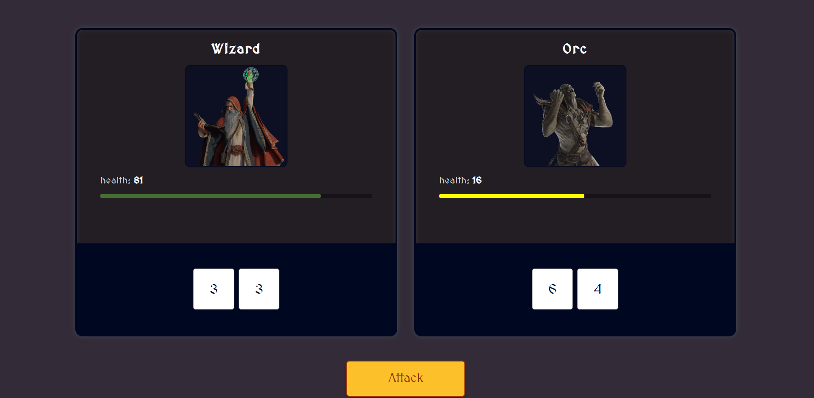

# CHARACTER VS GAME

This project was built during the scrimba frontend course. Feel free to enjoying the game!!

## Screenshots

## Credits

Thanks to [Scirmba Community](https://scrimba.com) for creating an awesome frontend development course from scratch. This allow me improve my programming skills a lot.

## Copyrigth

This project is just for enjoying the game, not commercial o professional purposes.

## About Scrimba

At Scrimba our goal is to create the best possible coding school at the cost of a gym membership! 💜
If we succeed with this, it will give anyone who wants to become a software developer a realistic shot at succeeding, regardless of where they live and the size of their wallets 🎉
The Frontend Developer Career Path aims to teach you everything you need to become a Junior Developer, or you could take a deep-dive with one of our advanced courses 🚀

- [Our courses](https://scrimba.com/allcourses)
- [The Frontend Career Path](https://scrimba.com/learn/frontend)
- [Become a Scrimba Pro member](https://scrimba.com/pricing)

Happy Coding!